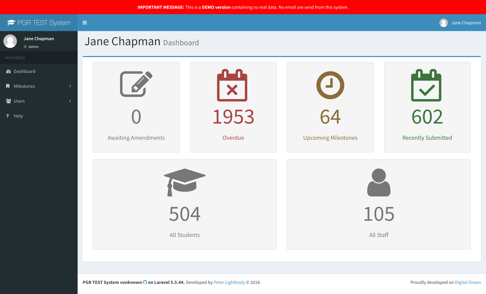

# A (not so) short Guide for Admins

## Login

* Simply go to the application's URL (e.g. [https://lcas.lincoln.ac.uk/pgr](https://lcas.lincoln.ac.uk/pgr)) and enter your usual university credentials

## Your Dashboard

After logging in the dashboard directly shows an overview of all students in the system. 
 

## Use Cases

* Enrolling a [new student](usecase_admin)
  * editing the student record
  * applying a "Timeline Template"
* [Correcting milestone dates](usecase_correction)
* [Archiving](usecase_archive) a student record (after the graduated/withdrew)
* Entering [interruptions](usecase_interruption)
* Viewing the [timeline of studies](images/timeline.png) and their submitted milestones
* Uploading [first submissions and amendments to Milestones](usecase_milestone) on behalf of Students
* [Reports](reporting)
  * Overdue Milestones
  * Students in Programme

