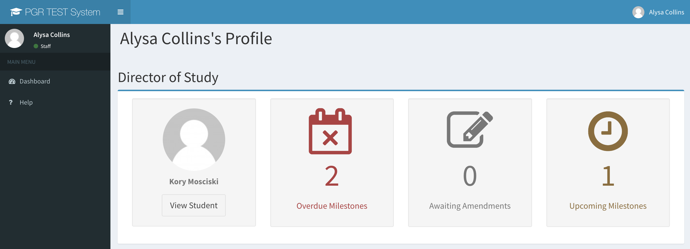

# A short Guide for Supervisors

## Login

* Simply go to the application's URL (e.g. [https://lcas.lincoln.ac.uk/pgr](https://lcas.lincoln.ac.uk/pgr)) and enter your usual university credentials

## Your Dashboard

After logging in the dashboard directly shows all upcoming, recently submitted, and overdue milestones for all your student. You can look at each student details from here
 

## Use Cases

* Viewing the [timeline of studies](usecase_timeline) and their submitted [milestones](milestone)
* Uploading [first submissions and amendments to Milestones](usecase_milestone) on behalf of Students

