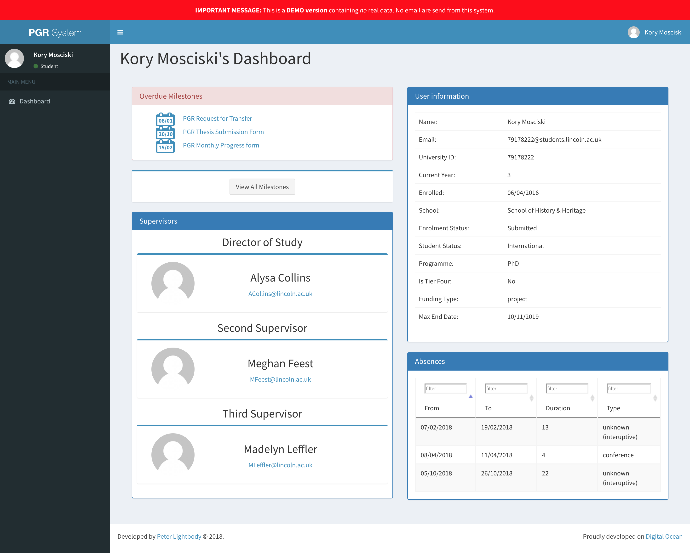
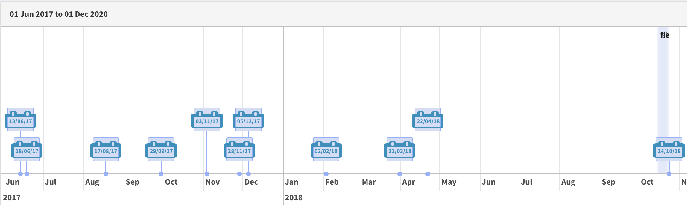
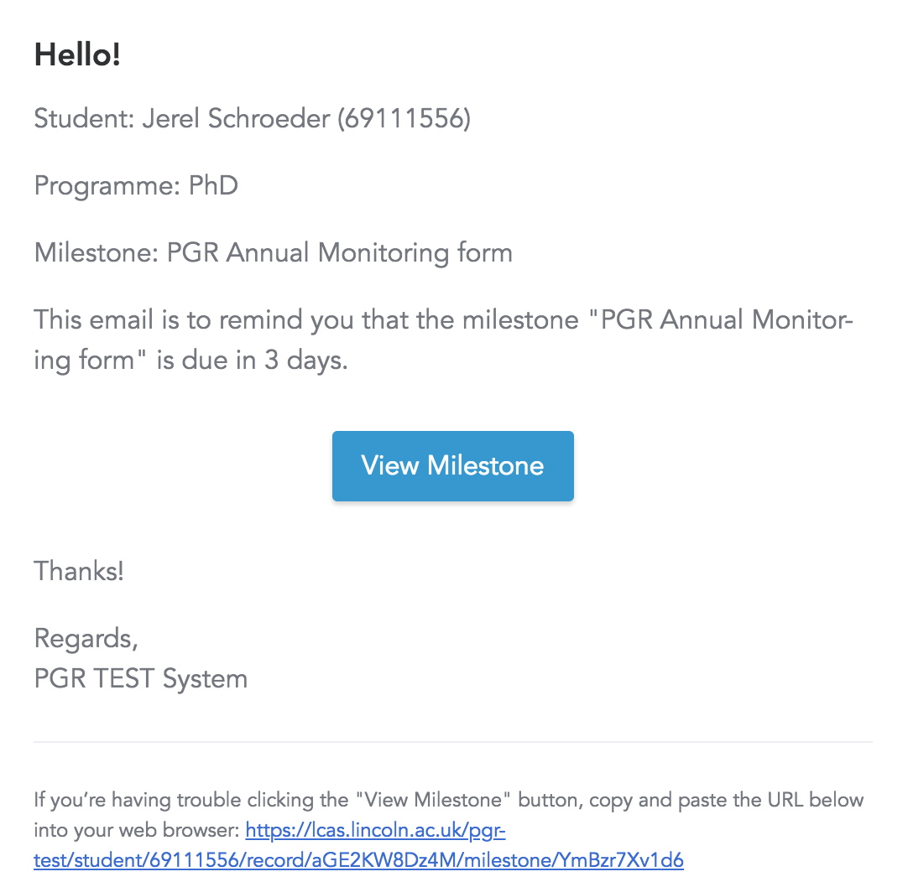
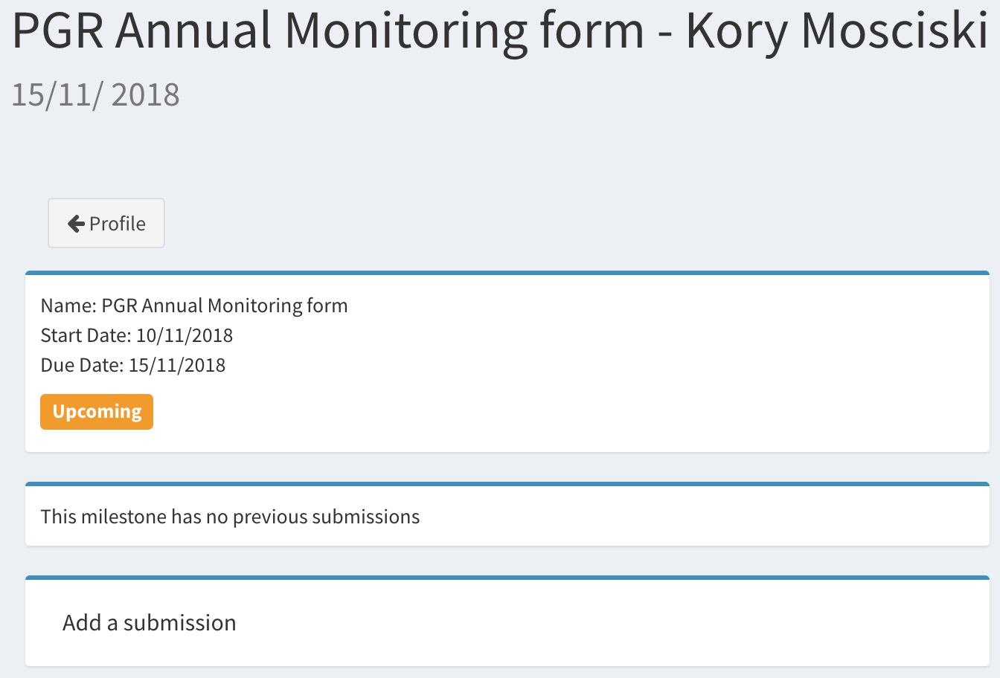

# A short Guide for Students

## Login

* Simply go to the application's URL (e.g. [https://lcas.lincoln.ac.uk/pgr](https://lcas.lincoln.ac.uk/pgr)) and enter your usual university credentials
* You may find your record still empty if your enrolment has not yet been processed by the admins

## Your Dashboard

After logging in the dashboard directly shows all upcoming, recently submitted, and overdue milestones. Also, you can check all the data the system holds in your record. Clicking on "View All Milestones" takes you to your [timeline](images/timeline.png)
 

## Use Cases for Students

* Viewing the [timeline of studies](usecase_timeline) and due milestones:
	Display your [PGR journey](template) one a timeline and show all the due dates for submission of the important documents, according to the PGR regulation of your institution:
	 
* Receiving [notifications](notification) by email about upcoming and due milestones:
	 
* Uploading [first submissions and amendments to Milestones](usecase_milestone)
	 
* Creating [optional Milestones](usecase_optional_milestone)

## Recording of Induction session (13/12/2018)

Apologies for the audio quality. This is an "as is" recording, only to complement the documentation here for anyone who missed the induction session.

<iframe src="https://uol.cloud.panopto.eu/Panopto/Podcast/StreamInBrowser/73bd3605-a24a-417d-b314-a9b500b5e42c.mp4?mediaTargetType=videoPodcast" width="720" height="405" style="padding: 0px; border: 1px solid #464646;" frameborder="0" allowfullscreen allow="autoplay"></iframe>
