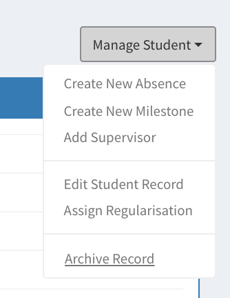

# Use Cases: Archiving a student record

At the end of a student's jounrey, either when they graduate or withdraw permanently from their studies, their record should be closed and archived. Admin can simple click on "Manage Student -> Archive Record" on a student's record page. Archived records are retained for 6 years (in-line with GDPR regulations) and can be restored through the student's page, if needed.
Archived records are not included in any dashboards any longer.

